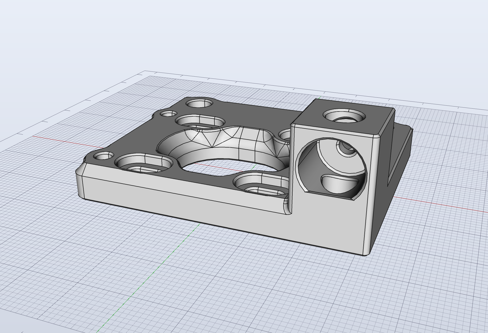

# Voron V0.2 quad cam lock
## Credit
[Voron team](https://github.com/VoronDesign/) 

## Print settings
Print according to official Voron [print settings](https://docs.vorondesign.com/sourcing.html#print-settings).

## Bom
* No extra hardware needed 

## Description
This mod replaces the tophat hinges on the AB drive frames with front idler cam locks. It is inteded to be combined with full height panels.

## Pictures

