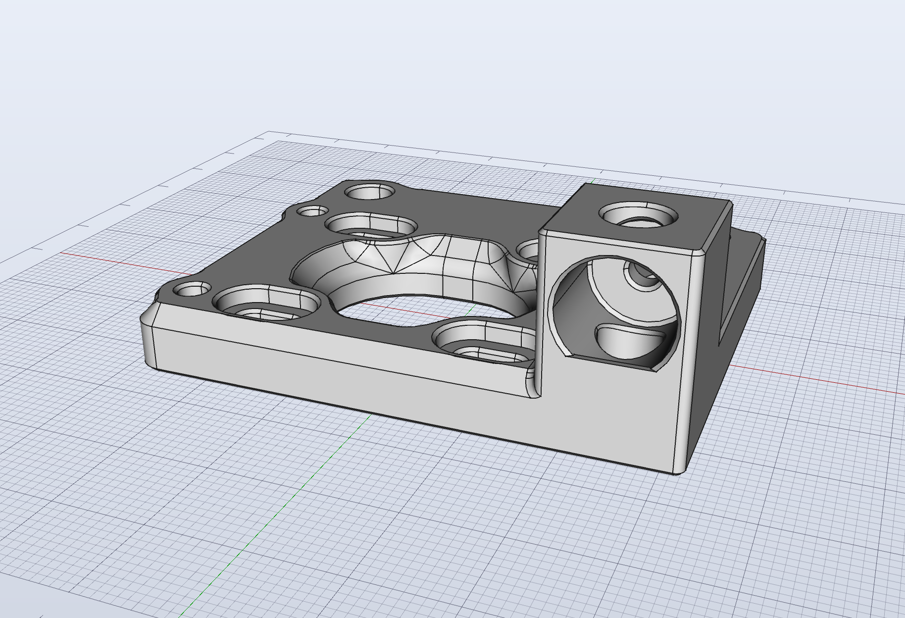
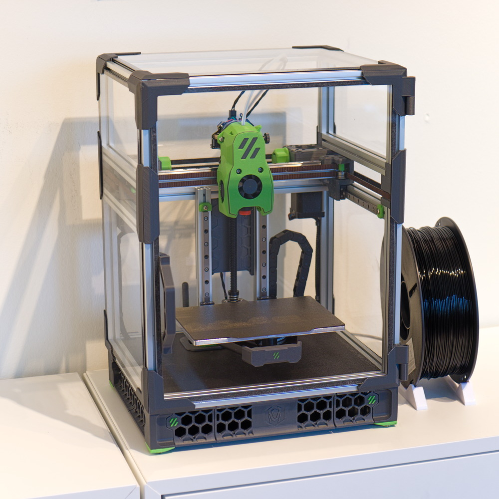

# Voron V0.2 quad cam lock

## Description
This mod replaces the tophat hinges on the AB drive frames with front idler cam locks. It is intended to be combined with full height panels.

It also includes custom made [Zero Panels](https://github.com/zruncho3d/ZeroPanels) for 2mm thick acrylic panels with 1mm thick foam. I used 
Tesa 4965 thin double sided tape to fix the panel clips to the door panel.

## Print settings
Print according to official Voron [print settings](https://docs.vorondesign.com/sourcing.html#print-settings).

## Bom for quad cams
* No extra hardware needed 

## Bom for zero panels
* 2mm thick full height acrylic panels
* 1mm adhesive foam tape
* Tesa 4965 double sided adhesive tape

## Credit
The [Voron team](https://github.com/VoronDesign/) for the original Voron V0 design

[Zruncho](https://github.com/zruncho3d/) for the original Zero Panels design.

## Pictures

